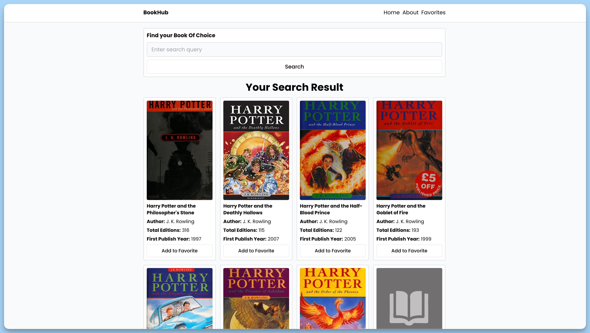
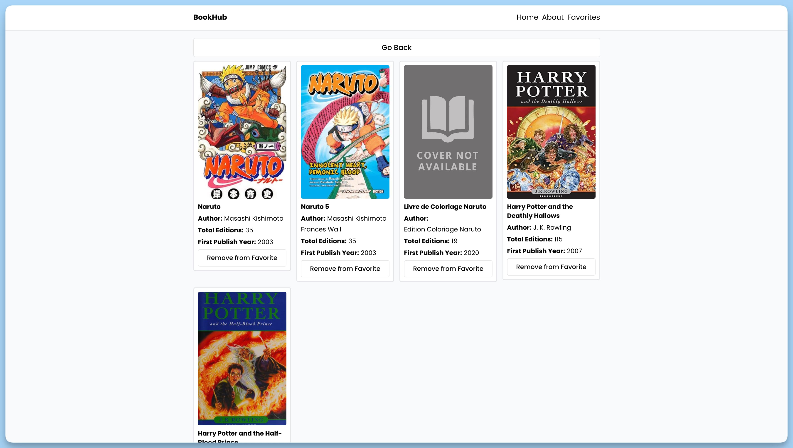
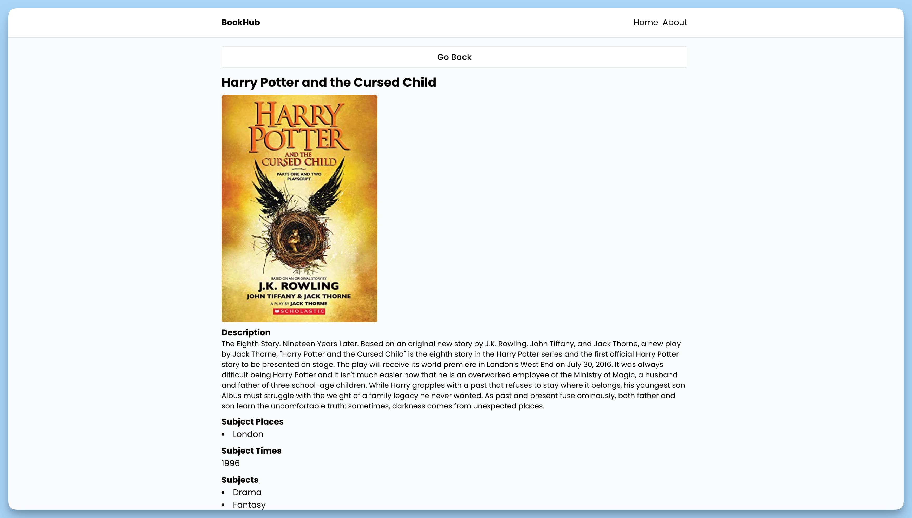

## 📦 Приложение - Поиск книг

### 🚀 Обзор

Данный код представляет собой главный компонент приложения "BookHub". Основные функции кода:

1. Импортирует необходимые зависимости, такие как `Toaster`, `Suspense`, `BrowserRouter`, `AppRoutes` и `Header`.

2. Создает React-компонент `App`, который является главным компонентом приложения.

3. В компоненте `App` определен следующий структурный макет:
  - `<BrowserRouter>` используется для управления маршрутизацией в приложении с использованием React Router.
  - `<Header />` представляет собой заголовок приложения.
  - `<Suspense>` используется для обработки состояния ожидания загрузки, отображая текст "Loading...", пока другие компоненты загружаются.
  - `<AppRoutes />` представляет собой компонент, который отображает основной контент приложения в зависимости от текущего маршрута.
  - `<Toaster>` представляет собой уведомления, отображаемые в нижней части экрана.

Компонент `App` служит главной точкой входа приложения "BookHub" 

### Компонент `Home`

Компонент `Home` представляет главную страницу приложения для поиска книг. Основные функции кода:

1. Импортирует необходимые зависимости, такие как `useState`, `useAppContext`, `toast`, `axios`, `Loader`, `Error` и `Book`, а также константы и изображение.

2. Создает React-компонент `Home`, который является страницей поиска книг.

3. В компоненте `Home` определены следующие основные элементы:
  - Использует состояние с помощью `useState` для отслеживания значения запроса (`query`) и заголовка (`title`).
  - Определяет функцию `handleSubmit` для обработки отправки формы поиска книг. Обработчик отправля запрос к API, обрабатывает результаты и обновляет состояние приложения в соответствии с ними. Также выводит сообщение об ошибке, если запрос завершился неудачно.
  - Определяет функцию `handleChange` для обработки изменения значения в поле ввода поиска.

4. Отображает форму для ввода поискового запроса с кнопкой "Search".

5. В случае наличия ошибки выводит компонент `Error`.

6. В случае ожидания загрузки данных, отображает компонент `Loader`.

7. Если есть результаты поиска (книги), отображает их в виде сетки книг, используя компонент `Book`.

8. Компонент `Home` является главной страницей для поиска книг в приложении "BookHub" и обрабатывает весь процесс поиска и отображения результат

### Компонент `Single`

Компонент `Single` представляет страницу с деталями о книге. Основные функции кода:

1. Импортирует необходимые зависимости, такие как `useNavigate`, `useParams`, `useAppContext`, `axios`, `useEffect`, `Loader`, `Error` и константы.

2. Создает React-компонент `Single`, который отображает информацию о книге.

3. В компоненте `Single` определены следующие основные элементы:
  - Использует хук `useParams` для получения параметра `id` из URL, представляющего идентификатор книги.
  - Использует хук `useNavigate` для навигации на предыдущую страницу.
  - Использует хук `useAppContext` для доступа к состоянию приложения и диспетчеру для управления им.

4. Определяет эффект `useEffect`, который выполняется при монтировании компонента. Этот эффект выполняет следующие действия:
  - Отправляет запрос к API, используя библиотеку `axios`, для получения информации о книге на основе `id`.
  - Обрабатывает полученные данные и обновляет состояние приложения с информацией о книге, включая заголовок, изображение обложки, описание, места, времена и темы.
  - Обрабатывает ошибки запроса и отображает компонент `Error`, если запрос завершился неудачно.

5. Отображает кнопку "Go Back", которая позволяет вернуться на предыдущую страницу.

6. В случае наличия ошибки, отображает компонент `Error`.

7. Если данные о книге доступны и загрузка завершилась успешно, отображает информацию о книге, включая изображение обложки, описание, места, времена и темы.

8. Компонент `Single` предоставляет подробную информацию о выбранной книге и позволяет пользователю вернуться на предыдущую страницу
9. 
### Компонент `Favorites`

Компонент `Favorites` представляет страницу "Избранное" и отображает список избранных книг. Основные функции кода:

1. Импортирует необходимые зависимости, такие как `useNavigate`, `useAppContext`, `Book` и интерфейс `IBook` из соответствующих модулей.

2. Создает React-компонент `Favorites`, который отображает список избранных книг.

3. В компоненте `Favorites` определены следующие основные элементы:
  - Использует хук `useAppContext` для доступа к списку избранных книг из состояния приложения.
  - Использует хук `useNavigate` для навигации на предыдущую страницу.

4. Отображает кнопку "Go Back", которая позволяет пользователю вернуться на предыдущую страницу.

5. Проверяет, есть ли книги в списке избранных:
  - Если список избранных книг пуст, отображает сообщение "Favorites is empty".
  - Если в списке избранных книг есть элементы, отображает их в виде сетки с использованием компонента `Book` для каждой книги.

6. Компонент `Favorites` предоставляет пользователю возможность просматривать и возвращаться к списку избранных книг

### Компонент `About`

Компонент `About` представляет страницу "О приложении" и содержит информацию о приложении "BookHub". Основные функции кода:

1. Создает React-компонент `About`, который представляет страницу "О приложении".

2. Внутри компонента `About` определены следующие элементы:
  - Создает контейнер с отступами, фоном и границей для размещения информации о приложении.
  - Выводит заголовок "About BookHub" с использованием жирного шрифта и установленного размера текста.
  - Предоставляет описание приложения, описывая его функциональность

3. Компонент `About` предоставляет пользователю информацию о приложении

---
#### 🌄 Превью:

-----
#### 🙌 Автор: [@nagoev-alim](https://github.com/nagoev-alim)

