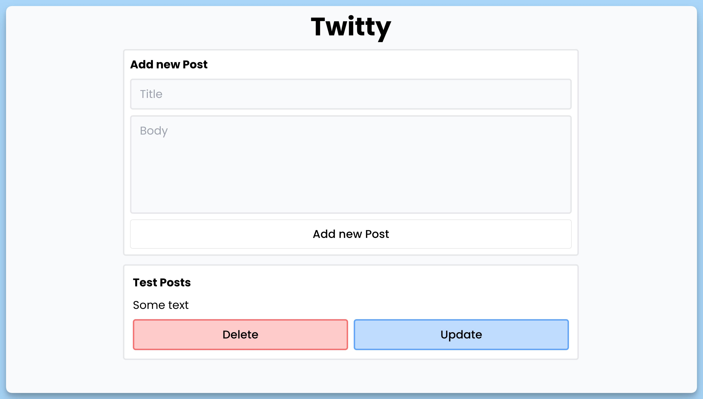

## 📦 Приложение - Публикация Постов

### 🚀 Обзор
Данный код представляет собой структуру React-приложения, разделенную на несколько компонентов. Вот краткое описание каждого компонента:

1. **App**:
  - Главный компонент приложения "Twitty".
  - Внутри него находятся компоненты `Form` и `Posts`.
  - Также используется компонент `Toaster` для отображения уведомлений.

2. **Form**:
  - Компонент формы для создания или обновления поста.
  - Содержит текстовые поля для ввода заголовка и содержания поста.
  - Имеет кнопку для отправки данных на сервер.
  - Включает обработчики событий для отправки данных и обновления поста.

3. **Posts**:
  - Компонент для отображения списка постов.
  - Отображает заголовки и содержание каждого поста.
  - Предоставляет функциональность удаления и обновления постов.
  - Может также отображать индикатор загрузки и сообщение об ошибке.

Оба компонента `Form` и `Posts` включают JSDoc комментарии, описывающие их функциональность и обработчики событий. Этот код создает интерфейс для управления и отображения постов, а также взаимодействует с сервером для создания, обновления и удаления постов.

---
#### 🌄 Превью:

-----
#### 🙌 Автор: [@nagoev-alim](https://github.com/nagoev-alim)

