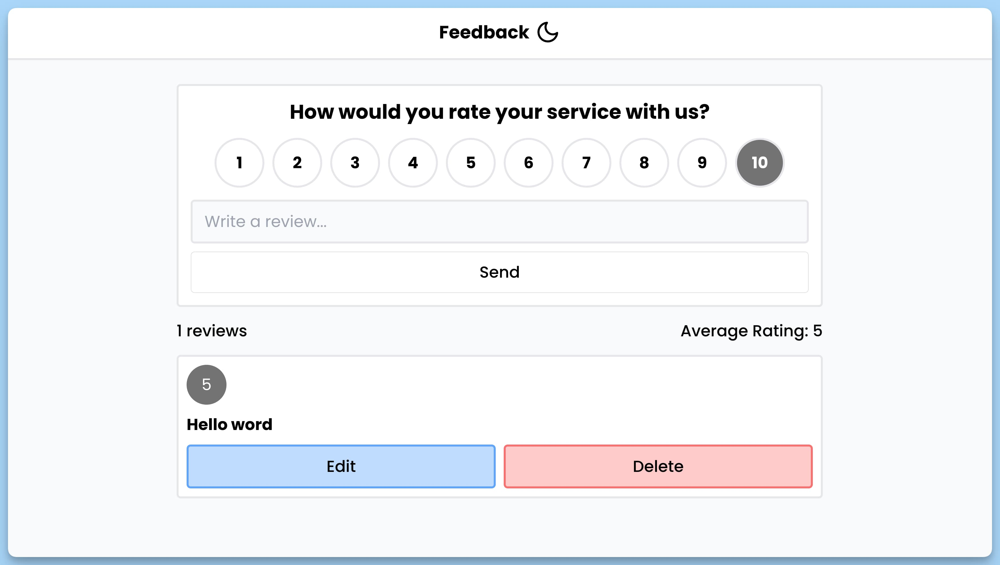

## 📦 Приложение - Публикация Отзывов

### 🚀 Обзор
Данный код представляет собой React-приложение, которое служит для сбора и отображения отзывов. Вот его структура и описание:

**App:**
- Компонент `App` является главным компонентом приложения "Feedback UI".
- Внутри компонента создается интерфейс для ввода отзывов и их отображения.
- Включает в себя другие компоненты: `Header`, `Form`, `Stats`, и `List`.
- Использует библиотеку `react-hot-toast` для отображения уведомлений.

**Form:**
- Компонент `Form` представляет собой форму для отправки отзывов.
- Содержит поля для ввода оценки и текста отзыва, а также кнопку для отправки.
- Может использоваться для создания новых отзывов или обновления существующих.
- Отображает разные надписи и выполняет разные действия в зависимости от режима (создание или редактирование).

**Stats:**
- Компонент `Stats` отображает статистику по отзывам, включая количество отзывов и средний рейтинг.

**List:**
- Компонент `List` служит для отображения списка отзывов.
- Отзывы могут быть редактированы или удалены.
- Предоставляет визуальное отображение каждого отзыва, включая оценку и текст.

**Header:**
- Компонент `Header` содержит заголовок приложения и кнопку для переключения темы (светлая/темная).

**Loading:**
- Компонент `Loading` представляет индикатор загрузки во время выполнения асинхронных операций.

**Error:**
- Компонент `Error` служит для отображения сообщения об ошибке, если что-то пошло не так.

Все компоненты используют контекст приложения (`useAppContext`), обрабатывают различные события и взаимодействуют с внешними функциями и хранилищем данных. Это приложение позволяет пользователям отправлять, просматривать и редактировать отзывы о чем-либо, а также отображать статистику и обрабатывать ошибки.

---
#### 🌄 Превью:

-----
#### 🙌 Автор: [@nagoev-alim](https://github.com/nagoev-alim)

