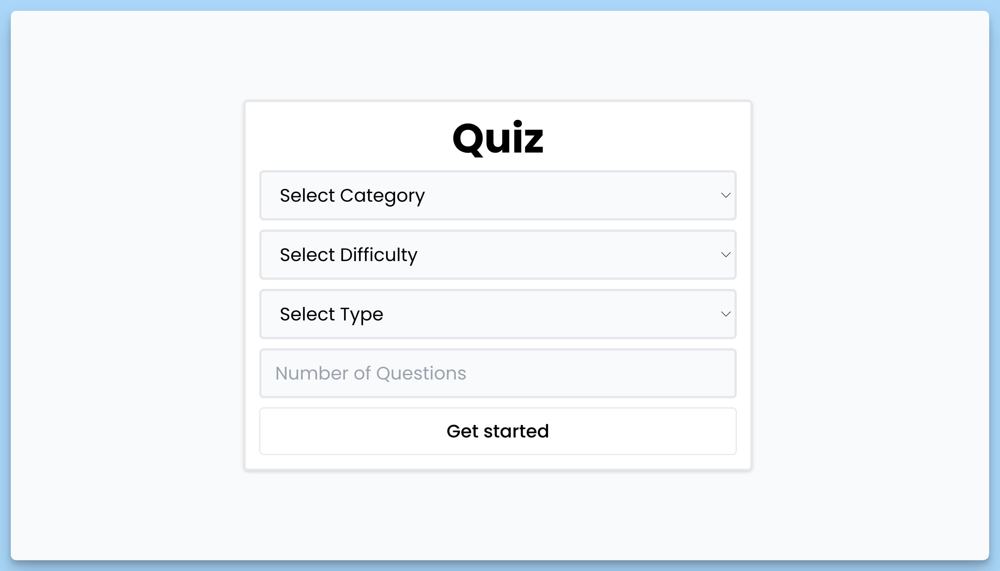

## 📦 Приложение - Квиз

### 🚀 Обзор

Код представляет собой React-компонент приложения "Quiz". Основное назначение данного компонента - это установка корневых компонентов для маршрутизации и определение позиции всплывающих уведомлений.

### Детали кода
- Используется библиотека "react-hot-toast" для отображения всплывающих уведомлений.
- Производится настройка маршрутизации с использованием "BrowserRouter" из библиотеки "react-router-dom".
- Используется компонент "Suspense" для отображения заглушки (сообщения "Loading...") во время загрузки содержимого маршрутов.
- Основное содержимое приложения представлено компонентом "AppRoutes", который управляет маршрутами приложения.
- Для установки всплывающих уведомлений внизу центра экрана, используется "Toaster" с настройкой позиции "bottom-center".

### Возвращаемое значение
- React-элемент с корневыми компонентами приложения.

Общее предназначение данного кода - создание основной структуры приложения, включая маршрутизацию и управление всплывающими уведомлениями.

### Компонент - `Setup`

Код представляет собой React-компонент, который позволяет пользователю настроить параметры викторины перед началом игры. Ниже представлено краткое описание данного компонента:

### Краткое описание
- Наименование компонента: Setup.
- Основное предназначение: Настройка параметров викторины перед началом игры.
- Возвращаемое значение: React-элемент компонента.

### Детали кода
- Компонент взаимодействует с контекстом приложения, получая доступ к методам и данным с использованием хука "useAppContext".
- Для получения категорий викторины используется хук "useAxios" для выполнения запроса к API и получения данных. Результат хранится в переменной "response".
- Если произошла ошибка при загрузке данных, компонент отображает сообщение об ошибке.
- В случае успешной загрузки данных или в процессе ожидания загрузки, компонент предоставляет форму с настройками викторины. Пользователь может выбирать категорию, уровень сложности и тип вопросов, а также указывать количество вопросов.
- Обработчик "handleSubmit" срабатывает при отправке формы настроек. Он проверяет, что все необходимые поля заполнены, и перенаправляет пользователя на страницу вопросов ("/questions").
- Обработчик "handleChange" отслеживает изменения значения в поле "Number of Questions" и обновляет его в контексте приложения.
- Если произошла ошибка при загрузке данных, компонент отображает сообщение об ошибке.
- В случае успешной загрузки данных или в процессе ожидания загрузки, компонент предоставляет форму с настройками викторины. Пользователь может выбирать категорию, уровень сложности и тип вопросов, а также указывать количество вопросов.

Общее предназначение данного кода - предоставление пользователю возможности настроить параметры викторины перед началом игры, а также управление переходом между страницами в приложении.

### Компонент - `Questions`

Код представляет собой React-компонент, предназначенный для отображения и обработки вопросов в викторине. Ниже представлено краткое описание данного компонента:

### Краткое описание
- Наименование компонента: Questions.
- Основное предназначение: Отображение и обработка вопросов в викторине.
- Возвращаемое значение: React-элемент компонента.

### Детали кода
- Компонент взаимодействует с контекстом приложения, получая доступ к методам и данным с использованием хука "useAppContext".
- С использованием хука "useAxios", компонент выполняет запрос к API, передавая параметры в URL в зависимости от выбранных настроек (категории, сложности, типа и количества вопросов).
- При получении ответа от API, вопросы и варианты ответов обрабатываются. Правильный ответ перемешивается с неправильными.
- При клике на вариант ответа вызывается обработчик "handleClick". Если выбранный ответ совпадает с правильным ответом, счетчик очков увеличивается на 1. Если еще есть вопросы, переходит к следующему вопросу, иначе перенаправляет пользователя на страницу "/score".
- Если произошла ошибка при запросе данных или загрузке, компонент отображает сообщение об ошибке.
- В случае успешной загрузки данных или в процессе ожидания загрузки, компонент предоставляет информацию о текущем вопросе и вариантах ответов, а также отображает текущий счет.

Общее предназначение данного кода - предоставление пользователю вопросов и вариантов ответов в рамках викторины и обработка его ответов с учетом правильности ответов.

### Компонент - `Finish`

Код представляет собой React-компонент, предназначенный для отображения экрана завершения викторины и обработки событий в этом контексте. Ниже представлено краткое описание данного компонента:

### Краткое описание
- Наименование компонента: Finish.
- Основное предназначение: Отображение экрана завершения викторины и обработка события "Play again".
- Возвращаемое значение: React-элемент компонента.

### Детали кода
- Компонент взаимодействует с контекстом приложения, получая доступ к методам и данным с использованием хука "useAppContext".
- При монтировании компонента с помощью хука "useEffect", генерируется эффект "confetti" с анимацией падающих конфетти на экране.
- Обработчик "handleClick" вызывается при клике на кнопке "Play again". Этот обработчик сбрасывает счет игрока и количество вопросов, а затем перенаправляет пользователя на начальный экран.
- Информация о количестве правильных ответов (счет) и общем количестве вопросов отображается на экране завершения.

Общее предназначение данного кода - завершение викторины, отображение счета, анимации и предоставление возможности начать викторину заново.

---
#### 🌄 Превью:

-----
#### 🙌 Автор: [@nagoev-alim](https://github.com/nagoev-alim)

