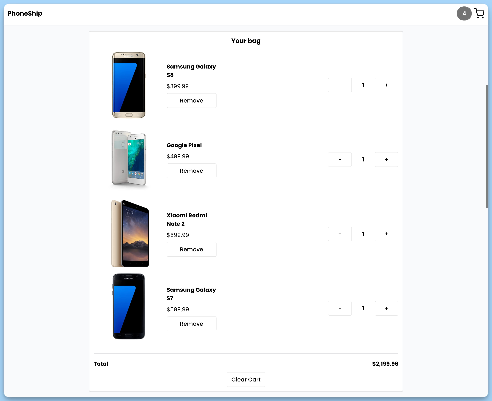

## 📦 Приложение - Корзина

### 🚀 Обзор
Этот код представляет собой главный компонент приложения "PhoneShip", который реализует интерфейс для отображения и управления товарами в корзине пользователя. Компонент выполняет следующие задачи:

- Отображает название приложения "PhoneShip" в верхней части страницы.
- Отображает иконку корзины и количество товаров в корзине в верхней части страницы.
- Отображает список продуктов в корзине с информацией о каждом продукте, его изображении, названии, цене и количестве.
- Предоставляет возможность увеличения и уменьшения количества товаров в корзине.
- Предоставляет возможность удаления продукта из корзины.
- Отображает общую стоимость товаров в корзине.
- Предоставляет кнопку для очистки корзины.
- Использует всплывающие уведомления с помощью компонента `Toaster` для вывода сообщений.

Данный код также содержит JSDoc комментарии, описывающие функции и обработчики событий внутри компонента, что облегчает понимание его функциональности.

---
#### 🌄 Превью:

-----
#### 🙌 Автор: [@nagoev-alim](https://github.com/nagoev-alim)

