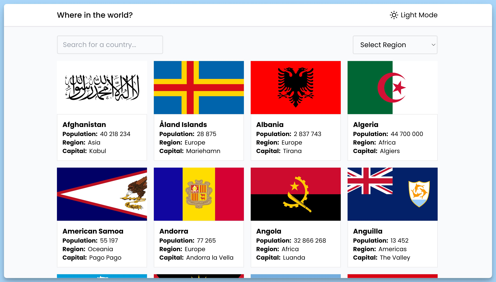
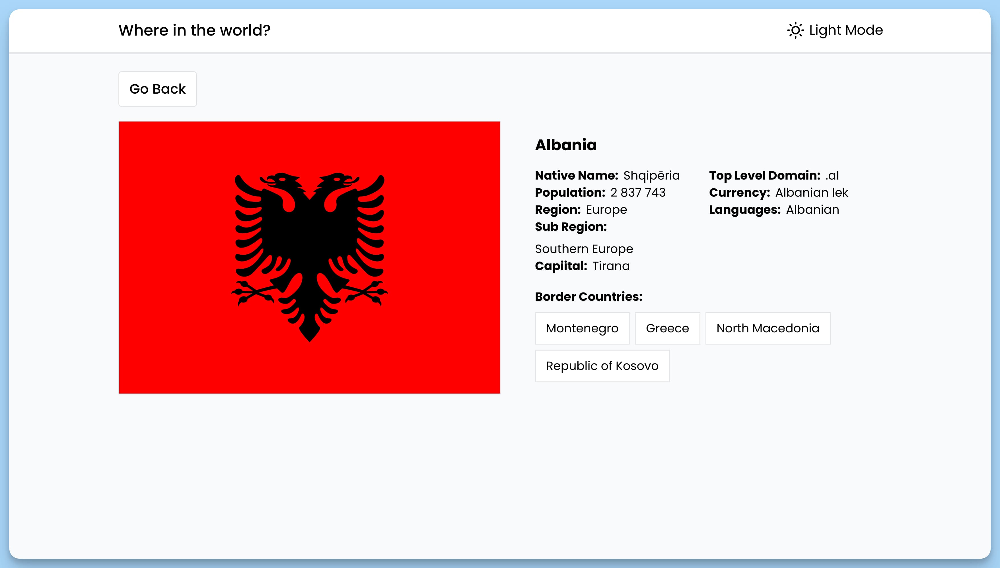
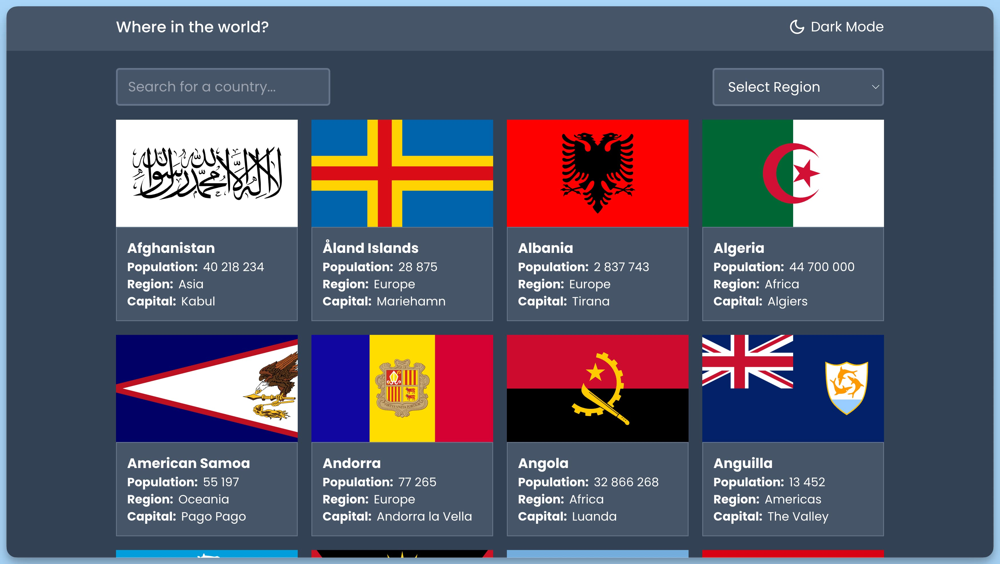

## 📦 Приложение - Поиск информации о стране

### 🚀 Обзор
Этот код представляет собой веб-приложение "REST Countries". Вот краткое описание того, что делает каждая из его частей:

### `App` Компонент

- Главный компонент приложения.
- Использует `BrowserRouter` из библиотеки `react-router-dom` для маршрутизации.
- Выводит `Header` в верхней части страницы.
- Отображает основной контент приложения, представленный компонентом `AppRoutes`.
- Использует `Toaster` из `react-hot-toast` для отображения уведомлений внизу страницы.

### `Home` Компонент

- Отображает список стран с помощью компонента `Link` из `react-router-dom`.
- Позволяет фильтровать страны по регионам и строке запроса с помощью компонента `Filter`.
- Загружает информацию о странах с использованием API и кэширует данные в `localStorage`.
- Обрабатывает ошибки и отображает уведомления при неудачных запросах.

### `Filter` Компонент

- Позволяет пользователю вводить поисковый запрос и выбирать регион из выпадающего списка.
- Изменения в `input` и `select` сразу вызывают обновление фильтрации с помощью функции `handleFilter`.

### `Single` Компонент

- Отображает информацию о выбранной стране, включая флаг, название, регион и другие атрибуты.
- Позволяет пользователю вернуться на предыдущую страницу с помощью кнопки "Go Back".
- Отображает информацию о ближайших соседях и переход к ним с помощью `Link`.
- Обрабатывает ошибки и отображает уведомления при неудачных запросах.

Это веб-приложение предоставляет информацию о разных странах и позволяет пользователю исследовать данные о них, фильтровать их и получать уведомления об ошибках при запросах к серверу.

---
#### 🌄 Превью:

-----
#### 🙌 Автор: [@nagoev-alim](https://github.com/nagoev-alim)

