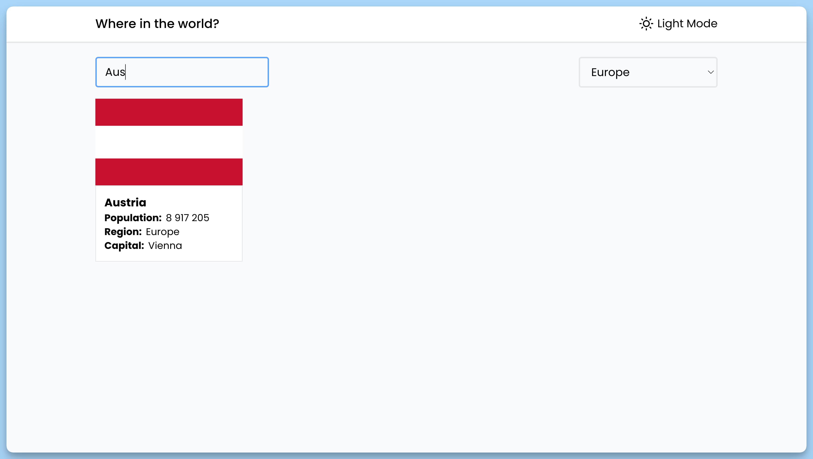
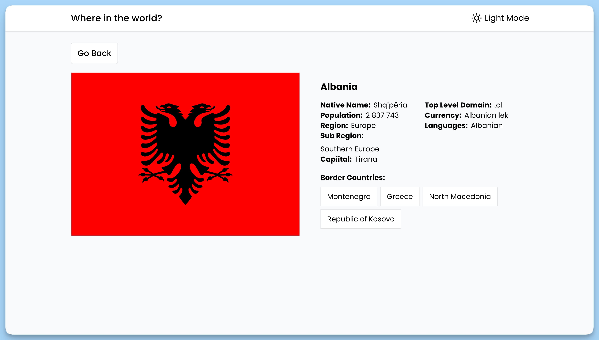
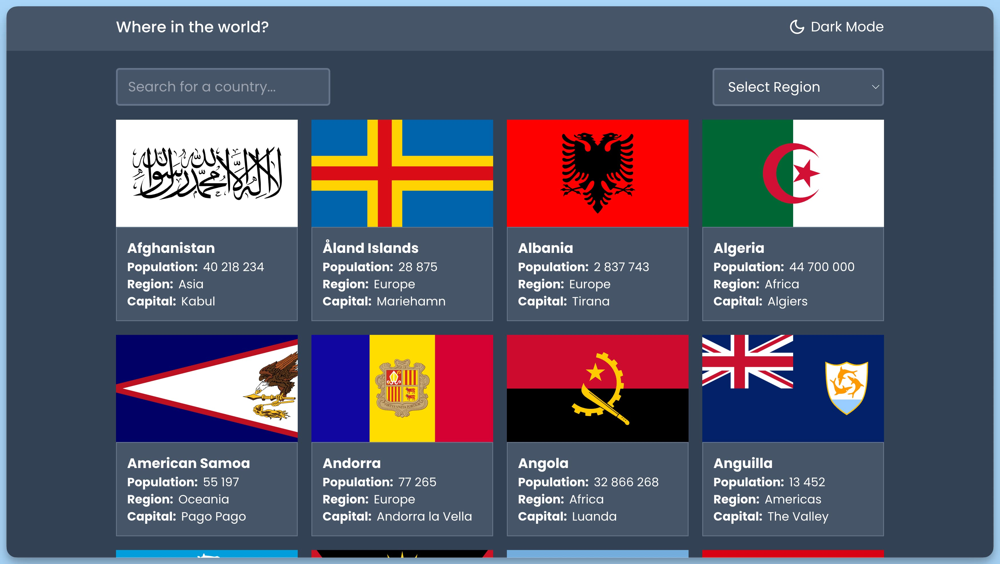

## 📦 Приложение - Поиск информации о стране

### 🚀 Обзор
### Краткое описание кода

Данный код представляет собой приложение "REST Countries" и включает в себя три React-компонента: `App`, `Home`, и `Single`, которые обеспечивают функциональность для отображения списка стран, информации о выбранной стране и переключения темы интерфейса. Приложение также использует библиотеку `react-router-dom` для маршрутизации и `react-hot-toast` для уведомлений.

### Описание компонентов

#### `App`

- Главный компонент приложения "REST Countries".
- Использует маршрутизацию с `BrowserRouter` из `react-router-dom`.
- Внутри содержит компонент `Header`, который отображает заголовок приложения.
- Выводит компонент `AppRoutes` в `Suspense` с отображением загрузки "Loading..." в случае ожидания загрузки данных.
- Использует `Toaster` для отображения уведомлений в нижней части экрана.

#### `Home`

- Отображает список стран с фильтрацией и маршрутизацией.
- Использует компонент `Filter` для фильтрации списка стран.
- Выводит список стран с изображениями и информацией о каждой стране.
- В случае загрузки данных, отображает "Loading..." с использованием компонента `Loading`.

#### `Single`

- Отображает информацию о выбранной стране.
- Позволяет переключиться назад к списку стран.
- Отображает информацию о стране, включая флаг, название, национальное название, население, регион и другие характеристики.
- Выводит информацию о граничащих странах, если они есть.
- В случае загрузки данных, отображает "Loading..." с использованием компонента `Loading`.

### Контекст и Хуки

- Для обмена данными между компонентами используется контекст `useAppContext`, который предоставляет доступ к состоянию приложения и функциям для его обновления.
- Хуки `useEffect` используются для выполнения операций при монтировании компонентов.
- Данные о странах загружаются с сервера с использованием HTTP-запросов и обрабатываются с использованием функций `fetchCountries` и `fetchCountry`.
- Для управления состоянием приложения используется функция `useReducer` с `reducer` и `initialState`.
- Для переключения между темами интерфейса используется функция `handleThemeToggle`.

---
#### 🌄 Превью:

-----
#### 🙌 Автор: [@nagoev-alim](https://github.com/nagoev-alim)

