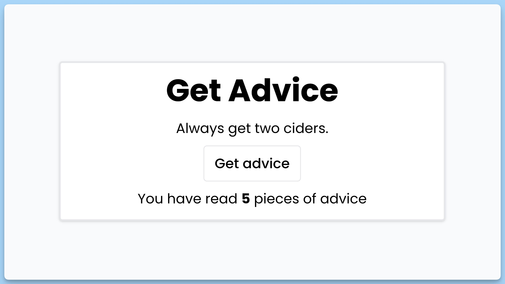

## 📦 Приложение - Случайный совет

### 🚀 Обзор

Данный код представляет собой простое веб-приложение, которое получает случайные советы с веб-сервиса "https://api.adviceslip.com/advice" и отображает их для пользователя. Приложение использует библиотеку `react-hot-toast` для отображения уведомлений и `axios` для выполнения HTTP-запросов.

### Описание компонента

#### `App`

- Главный компонент приложения.
- Содержит состояние совета (`advice`), счетчика (`count`) и состояния загрузки (`loading`).
- При монтировании компонента вызывается функция `handleGetAdvice`, которая выполняет запрос к веб-сервису и получает случайный совет.
- Полученный совет отображается на экране внутри `div`, а также отображается количество советов, которое пользователь прочитал.
- Приложение предоставляет кнопку "Get advice", которая позволяет получить новый случайный совет.
- В случае возникновения ошибки при запросе, отображается сообщение об ошибке с помощью `toast.error`.
- Внизу экрана используется `Toaster` из `react-hot-toast` для отображения уведомлений в нижней части окна.

#### Интерфейс пользователя

- Пользователь видит название "Get Advice", случайные советы и количество советов, которые он прочитал.
- При нажатии на кнопку "Get advice" генерируется новый случайный совет.
- В случае ошибки при получении совета, пользователю показывается уведомление об ошибке.
- Пользователь может видеть, сколько советов он уже получил.

Это мини-приложение предоставляет пользователю случайные советы и отслеживает, сколько советов было прочитано.

---
#### 🌄 Превью:

-----
#### 🙌 Автор: [@nagoev-alim](https://github.com/nagoev-alim)

