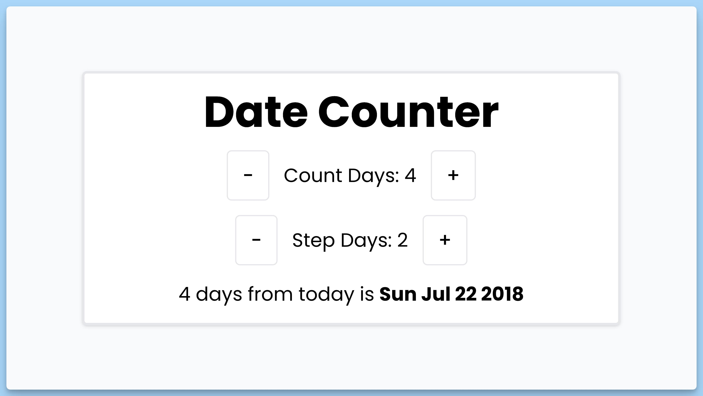

## 📦 Приложение - Счетчик дней относительно даты

### 🚀 Обзор
Этот код представляет собой React-компонент с названием "Date Counter", который создает интерфейс для подсчета и отображения даты на основе текущего количества дней и шага изменения.

Вот краткое описание его функциональности:

- Пользователь видит текущее количество дней и шаг изменения.
- При нажатии на кнопки "—" и "+" можно уменьшить и увеличить количество дней соответственно.
- Пользователь также может уменьшить и увеличить шаг изменения дней.
- Дата рассчитывается на основе текущей даты и количества дней.
- Информация о дате отображается в центральной части компонента.
- Используется библиотека `react-hot-toast` для отображения всплывающих уведомлений в нижней части компонента.

Этот компонент предоставляет пользователю интерфейс для управления отображаемой датой и шага изменения дней.

---
#### 🌄 Превью:

-----
#### 🙌 Автор: [@nagoev-alim](https://github.com/nagoev-alim)

