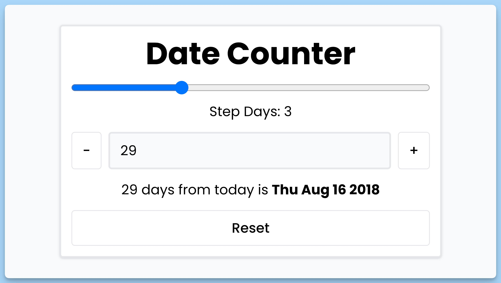

## 📦 Приложение - Счетчик дней относительно даты

### 🚀 Обзор
Данный код представляет собой React-компонент приложения "Date Counter", который позволяет пользователю управлять и отслеживать количество дней и шаг изменения количества дней. Компонент включает в себя следующие основные элементы:

1. **Состояния `count` и `step`** хранят текущее количество дней и шаг изменения соответственно.

2. **Создание объекта `date`** с заданной датой "July 18 2018" и динамически обновляемой датой, основываясь на текущем значении `count`.

3. Функции `incrementCount` и `decrementCount` позволяют пользователю увеличивать или уменьшать количество дней на величину `step`.

4. Функция `handleReset` сбрасывает значения `count` и `step` в исходное состояние.

5. Функции `handleStep` и `handleCount` обрабатывают изменения значения шага и количества дней, соответственно, на основе введенных пользователем данных.

6. Интерфейс включает в себя вводное поле для ввода количества дней, ползунок для настройки шага, и кнопки для управления изменением количества дней и шага.

7. Ниже отображается текст, который зависит от текущего значения `count` и показывает, сколько дней это количество представляет и соответствующую дату.

8. Кнопка "Reset" доступна для сброса значений, если `count` не равно нулю или `step` не равно единице.

9. Используется компонент `Toaster` для вывода уведомлений в нижней части экрана.

Компонент предоставляет пользователю возможность интерактивно управлять и отслеживать количество дней, а также шаг изменения этого количества.

---
#### 🌄 Превью:

-----
#### 🙌 Автор: [@nagoev-alim](https://github.com/nagoev-alim)

