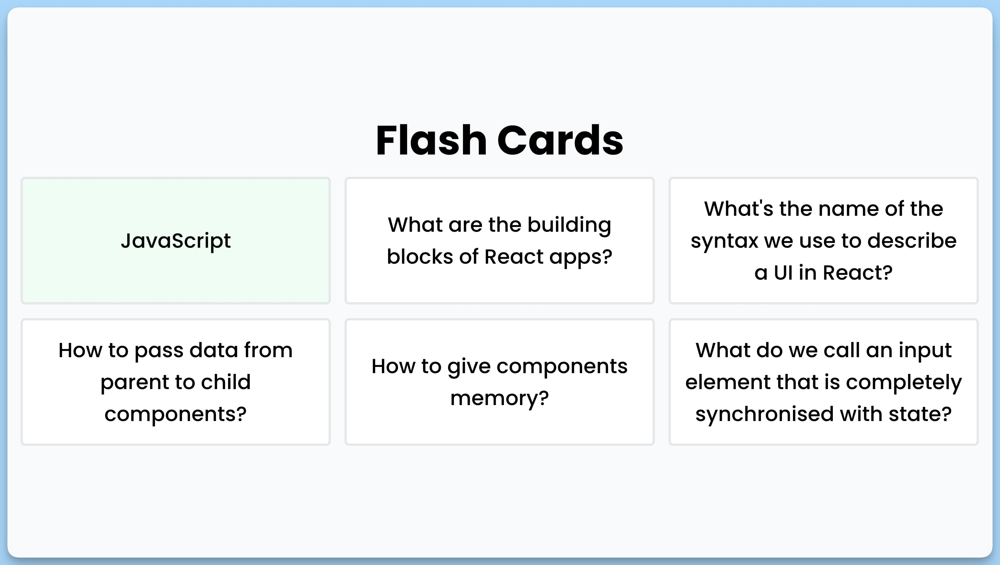

## 📦 Приложение - Карточки с вопросами/ответами

### 🚀 Обзор
# Описание кода: Flash Cards

Данный код представляет собой React-компонент для приложения "Flash Cards". Приложение предназначено для изучения карточек с вопросами и ответами. Каждая карточка имеет уникальный идентификатор, текст вопроса и текст ответа.

### Интерфейс `Card`
Этот интерфейс описывает структуру карточки с полями:
- `id` (уникальный идентификатор карточки)
- `question` (текст вопроса)
- `answer` (текст ответа)

### Состояние `selectedId`
В данном состоянии хранится идентификатор выбранной карточки или `null`, если ни одна карточка не выбрана.

### Функция `handleClick`
Эта функция обрабатывает щелчки по карточкам. Она изменяет состояние `selectedId`, чтобы отобразить ответ, если карточка выбрана, и скрыть ответ при повторном щелчке.

### Отображение карточек
В компоненте используется цикл для отображения карточек из массива `mock`. Выбранные карточки выделяются зеленым цветом.

### `Toaster`
Используется компонент `Toaster` для вывода уведомлений в нижней части экрана.

## Примечание
Информация о структуре карточек и их содержании должна быть предварительно определена в файле `mock`, который импортируется в компоненте.

---
#### 🌄 Превью:

-----
#### 🙌 Автор: [@nagoev-alim](https://github.com/nagoev-alim)

