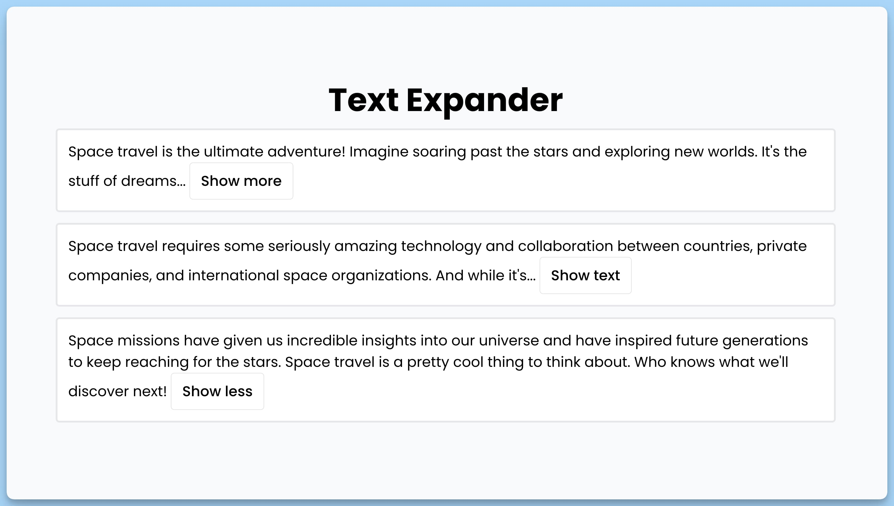

## 📦 Приложение - Расширитель текста

### 🚀 Обзор
Код представляет собой React-приложение, в котором главный компонент `App` содержит карточки `TextExpander`, которые могут сворачивать и разворачивать текст.

### `App` - Главный компонент приложения

- `App` - это главный компонент приложения "Text Expander".
- Он содержит заголовок и несколько карточек `TextExpander`.

### `ITextExpanderProps` - Интерфейс для пропсов `TextExpander`

- `ITextExpanderProps` - это интерфейс, описывающий пропсы компонента `TextExpander`.
- Пропсы включают в себя текст дочерних элементов, настройки для сворачивания/разворачивания текста и стилевые параметры.

### `TextExpander` - Компонент для сворачивания текста

- `TextExpander` - это компонент, который позволяет сворачивать и разворачивать текст, используя кнопки.
- Он принимает текст в виде дочерних элементов и имеет настройки для количества видимых слов в свернутом состоянии, текста кнопок и цвета кнопок.
- Компонент `TextExpander` позволяет пользователям показывать или скрывать текст, нажимая на кнопку.

---
#### 🌄 Превью:

-----
#### 🙌 Автор: [@nagoev-alim](https://github.com/nagoev-alim)

