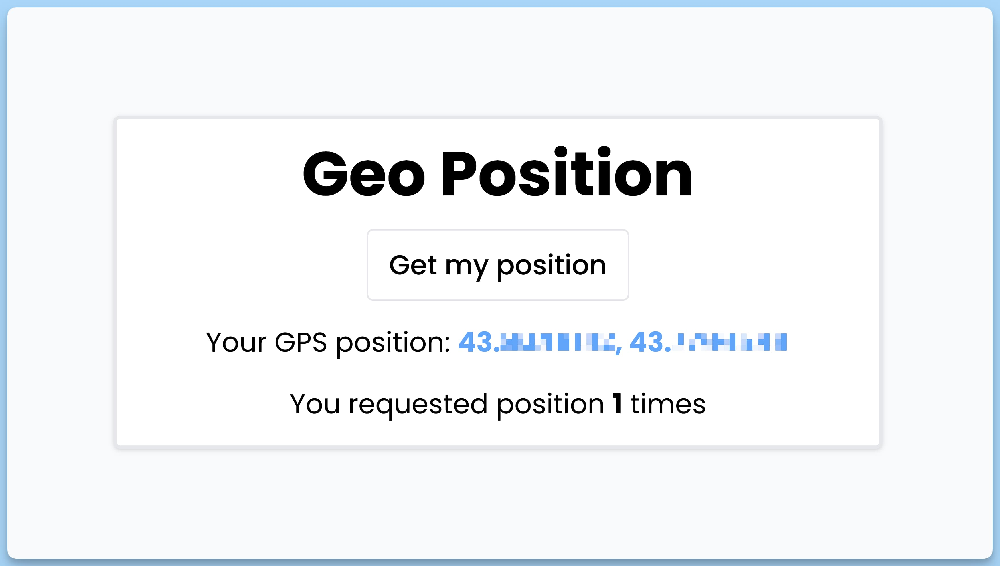

## 📦 Приложение - Получение геопозиции пользователя

### 🚀 Обзор
Данный код представляет собой React-приложение, которое использует пользовательский хук для получения геопозиции пользователя. Вот краткое описание его функциональности:

- Приложение содержит кнопку "Get my position", которая инициирует запрос геопозиции при щелчке.
- По нажатию на кнопку "Get my position", приложение увеличивает счетчик щелчков.
- Через пользовательский хук `useGeolocation`, приложение пытается получить геопозицию пользователя.
- Если браузер поддерживает геолокацию, приложение отображает текст "Loading position..." во время запроса.
- Если возникает ошибка (например, если пользователь не разрешил доступ к геопозиции), ошибка отображается на экране.
- Если геопозиция успешно получена, приложение отображает координаты широты и долготы, а также предоставляет ссылку для просмотра этой позиции на карте OpenStreetMap.
- Под счетчиком щелчков отображается информация о том, сколько раз была запрошена геопозиция.

Это приложение предоставляет пользователю способ получения географических координат и отслеживает количество запросов геопозиции.

---
#### 🌄 Превью:

-----
#### 🙌 Автор: [@nagoev-alim](https://github.com/nagoev-alim)

