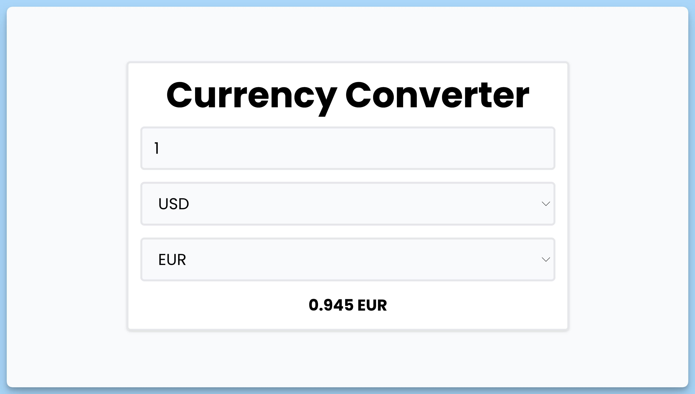

## 📦 Приложение - Простой конвертер валют

### 🚀 Обзор
Данный код представляет собой React-приложение "Simple Currency Converter," которое позволяет пользователю конвертировать суммы денег из одной валюты в другую. Вот краткое описание его функциональности:

- Пользователь может ввести сумму, выбрать исходную и целевую валюты с помощью выпадающих списков.
- При изменении исходной валюты, целевой валюты или суммы для конвертации, происходит автоматический запрос к внешнему API для получения актуального курса обмена.
- Если исходная и целевая валюты совпадают, то выводится исходная сумма без изменений.
- При ошибках в запросе или при недоступности внешнего API выводится сообщение об ошибке.
- Показывает прелоадер во время выполнения запроса.
- Использует библиотеку `react-hot-toast` для вывода всплывающих уведомлений.

Это приложение предоставляет пользователю простой интерфейс для конвертации валюты и обновления курсов обмена.

---
#### 🌄 Превью:

-----
#### 🙌 Автор: [@nagoev-alim](https://github.com/nagoev-alim)

