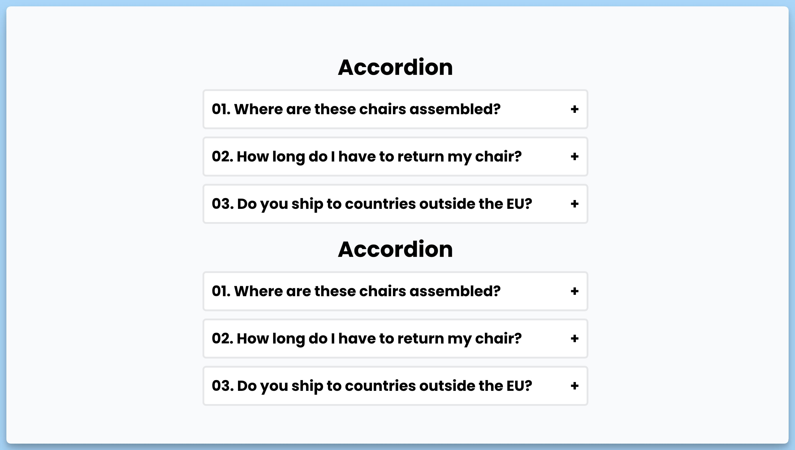

## 📦 Приложение - Аккордеон

### 🚀 Обзор
Данный код представляет собой реализацию аккордеона в виде React-компонентов. Вот краткое описание кода:

1. Создаются массивы данных (`data`), каждый элемент которых представляет собой вопрос и ответ в аккордеоне.

2. Создан React-компонент `Example01`, который представляет собой аккордеон, в котором отображаются вопросы и ответы из массива `data`.

3. Для каждого элемента аккордеона создается компонент `Item`, который имеет свой собственный статус "открыто/закрыто" (`open`) и обрабатывает события клика для переключения состояния.

4. Аналогично, создается компонент `Example02`, который также представляет аккордеон с вопросами и ответами из массива `data`, но с возможностью открывать только один элемент в один момент времени.

Оба примера демонстрируют, как можно создать компонент аккордеона в React, где пользователь может кликнуть на вопрос, чтобы увидеть ответ.

---
#### 🌄 Превью:

-----
#### 🙌 Автор: [@nagoev-alim](https://github.com/nagoev-alim)

