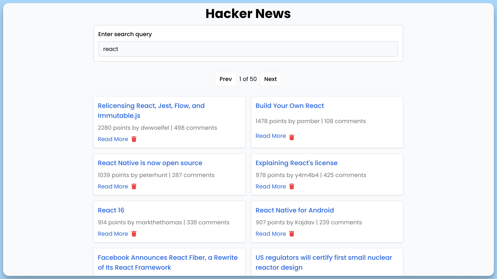

## 📦 Приложение - Hacker News

### 🚀 Обзор
Данный проект представляет собой веб-приложение с интерфейсом "Hacker News", которое позволяет пользователю осуществлять поиск и просматривать новости с сайта Hacker News. В приложении реализованы основные компоненты, такие как форма поиска, навигационные кнопки и отображение списка новостей. Приложение также поддерживает удаление новостей.

### Компонент App

### Описание

`App` - главный компонент приложения "Hacker News", который включает в себя другие компоненты для отображения формы поиска, списка новостей и навигационных кнопок.

### Импорты

- `Toaster` из `react-hot-toast` для отображения уведомлений.
- `Buttons`, `Form`, `Stories` из локальных компонентов для отображения формы поиска, списка новостей и навигационных кнопок.

### Компонент `Form`

### Описание

`Form` - компонент для отображения формы поиска новостей на сайте Hacker News.

### Состояние

- `q` (query) - состояние для хранения значения ввода поискового запроса.

### Методы

- `handleSubmit` - обработчик отправки формы поиска, выполняет поиск новостей и сбрасывает значение запроса.
- `handleChange` - обработчик изменения значения ввода поискового запроса.

### Компонент `Buttons`

### Описание

`Buttons` - компонент для отображения навигационных кнопок "Prev" и "Next" для переключения между страницами с новостями.

### Состояние

- `isLoading` - состояние, указывающее на загрузку данных.
- `page` - текущая страница с новостями.
- `nbPages` - общее количество страниц с новостями.

### Методы

- `handlePage` - обработчик смены страницы.

### Компонент `Stories`

### Описание

`Stories` - компонент для отображения списка новостей.

### Состояние

- `isLoading` - состояние, указывающее на загрузку данных.
- `hits` - массив новостей.
- `removeStory` - функция для удаления новости.

### Отображение

- Если данные загружаются, отображается индикатор загрузки.
- Для каждой новости выводится заголовок, количество баллов, автор, количество комментариев и кнопка "Read More" для перехода по ссылке.
- Для каждой новости также предоставляется кнопка "Remove" для удаления новости.

---
#### 🌄 Превью:

-----
#### 🙌 Автор: [@nagoev-alim](https://github.com/nagoev-alim)

