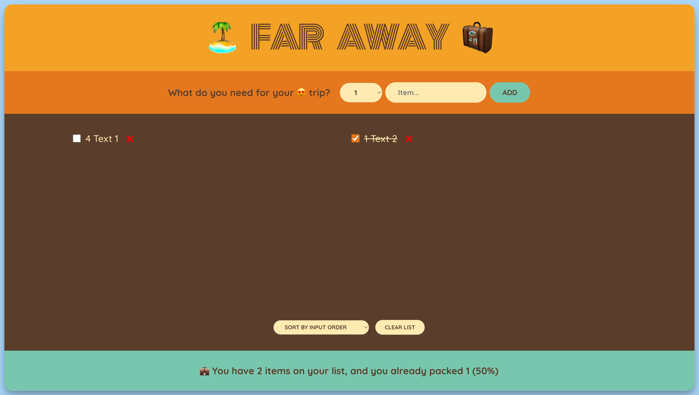

## 📦 Приложение - Список вещей для поездки

### 🚀 Обзор
Данный код представляет собой React-приложение "Far Away", предназначенное для управления списком элементов, которые нужно упаковать для поездки. Вот его структура и функциональность:

1. Определены несколько компонентов:

    - `App`: Главный компонент приложения, который содержит состояние для хранения списка элементов, функции для добавления, удаления, и изменения статуса элементов, а также функцию для очистки списка. Он также отображает форму для добавления элементов, список элементов и статистику упаковки.

    - `Form`: Компонент формы для добавления элементов. Он принимает функцию `onAddItems` для добавления новых элементов. Состояния хранятся для описания элемента и количества.

    - `PackingList`: Компонент списка элементов. Он отображает список элементов, позволяет сортировать их по разным критериям и имеет кнопку для очистки списка.

    - `Stats`: Компонент для отображения статистики по упаковке элементов. Он отображает общее количество элементов, упакованных элементов и процент упаковки.

2. В компоненте `App` установлено начальное состояние списка элементов как пустой массив.

3. Добавлены обработчики для управления списком элементов:

    - `handleAddItems`: Добавляет новый элемент в список.
    - `handleDeleteItem`: Удаляет элемент из списка по его идентификатору.
    - `handleToggleItem`: Переключает статус упаковки элемента по его идентификатору.
    - `handleClearList`: Очищает весь список элементов с подтверждением.

4. В компоненте `Form` созданы состояния для описания элемента и количества элементов. Также добавлены обработчики для изменения этих состояний и отправки формы.

5. В компоненте `PackingList` определен метод сортировки элементов по выбранному критерию. Также добавлен обработчик для изменения метода сортировки и отображение списка элементов.

6. В компоненте `Stats` отображается статистика о количестве и статусе упаковки элементов, включая процент упакованных элементов.

Это приложение позволяет пользователям создавать список элементов для поездки, управлять им, отслеживать статус упаковки и просматривать статистику по упаковке.

---
#### 🌄 Превью:

-----
#### 🙌 Автор: [@nagoev-alim](https://github.com/nagoev-alim)

