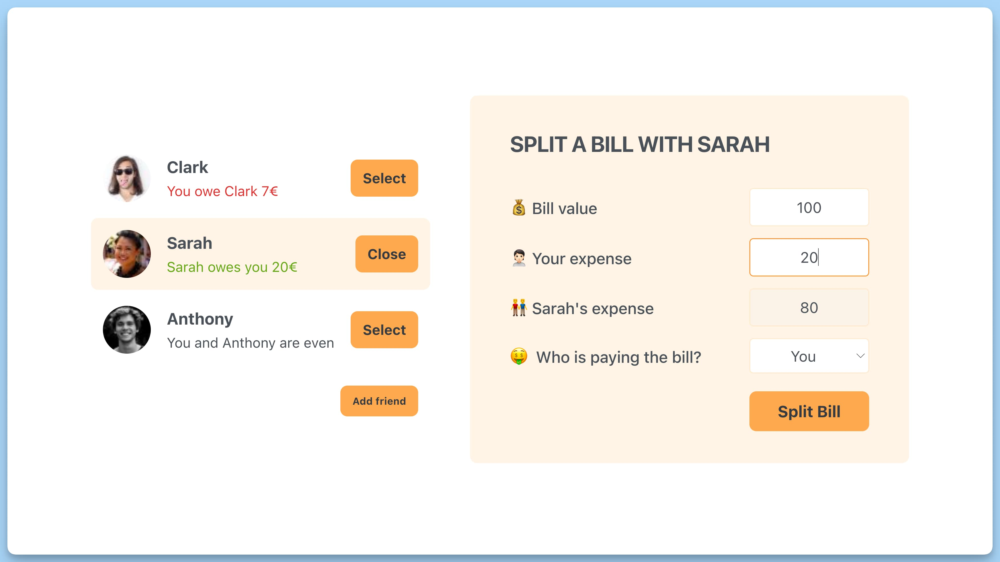

## 📦 Приложение - Разделения счета между друзьями

### 🚀 Обзор

Данный код представляет собой приложение "Eat-n-Split" в React, которое позволяет пользователям управлять списком друзей и разделять с ними счета. В коде определены несколько компонентов, интерфейсов и обработчиков событий:

- `Friend` - интерфейс, описывающий друзей, включая их уникальные идентификаторы, имена, изображения и балансы.
- `App` - главный компонент приложения. Он содержит состояния для отображения/скрытия формы добавления друга, списка друзей и выбранного друга. Он также содержит обработчики для добавления друга, выбора друга и разделения счета.
- `FriendsList` - компонент, который отображает список друзей. Он принимает список друзей для отображения, функцию выбора друга и информацию о выбранном друге.
- `FormAddFriend` - компонент для добавления нового друга. Он содержит форму с полями для имени и изображения друга и кнопку "Add", а также обработчики для изменения значений полей и отправки формы.
- `Button` - компонент кнопки с возможностью определения обработчика клика.
- `FormSplitBill` - компонент для разделения счета с другом. Он содержит поля для ввода суммы счета, расхода пользователя и выбора, кто оплачивает счет, а также кнопку "Split Bill".
- `FriendItem` - компонент, представляющий информацию о друге и позволяющий выбрать или закрыть его. Он отображает изображение, имя друга, информацию о балансе и кнопку для выбора или закрытия друга.

Весь код написан на React и использует хуки для управления состоянием компонентов. Приложение позволяет пользователям взаимодействовать с списком друзей, добавлять новых друзей, выбирать друга и разделять счета с выбранными друзьями.

---
#### 🌄 Превью:

-----
#### 🙌 Автор: [@nagoev-alim](https://github.com/nagoev-alim)

