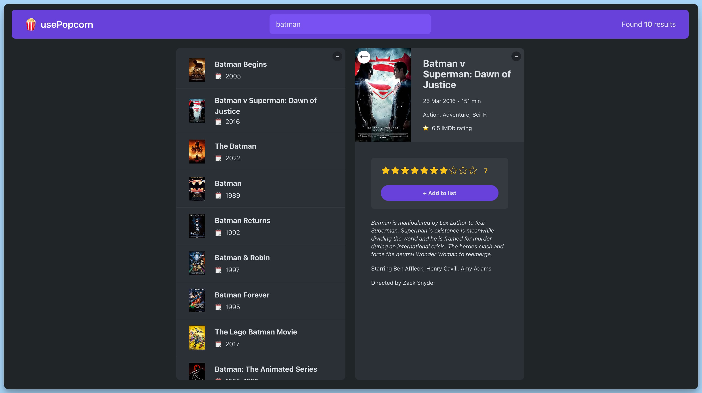

## 📦 Приложение - Поиск фильмов

### 🚀 Обзор

Данный код представляет собой React-приложение для поиска и отслеживания информации о фильмах. Основные компоненты приложения и их функциональность описаны ниже:

- **Компонент `App`**: Это главный компонент приложения, который управляет всей логикой и визуальным отображением. Он включает в себя следующие элементы:

    - Состояния `query` и `selectedId`, которые хранят текущий поисковый запрос и идентификатор выбранного фильма.
    - Использование `useMovies` для выполнения поиска фильмов на основе запроса `query`. Результаты, загрузка и ошибки хранятся в состоянии.
    - Использование `useLocalStorageState` для хранения информации о просмотренных фильмах.
    - Методы `handleSelectId`, `handleCloseMovie`, `handleAddWatched` и `handleRemoveWatched` для управления выбором, закрытием, добавлением и удалением фильмов из списка просмотренных.

- **Компоненты `NavBar`, `Logo`, `Search`, `ResultsNumber`**: Эти компоненты представляют верхнюю часть интерфейса приложения, включая логотип, поле поиска и отображение количества найденных результатов.

- **Компоненты `Main`, `Box`, `Loader`, `ErrorMessage`**: Эти компоненты представляют основную область приложения и управляют отображением информации о фильмах, загрузкой и сообщениями об ошибках.

- **Компоненты `MovieDetails`, `List`, `WatchedSummary`**: Эти компоненты отвечают за отображение деталей фильма, списка фильмов и сводной информации о просмотренных фильмах. В зависимости от действий пользователя, один из этих компонентов будет отображаться.

Комментарии JSDoc в коде предоставляют информацию о каждой функции, описывая их назначение, параметры и возвращаемые значения. Они также описывают компонент `App` и его основную функциональность как главного компонента приложения "MovieSearch".

---
#### 🌄 Превью:

-----
#### 🙌 Автор: [@nagoev-alim](https://github.com/nagoev-alim)

