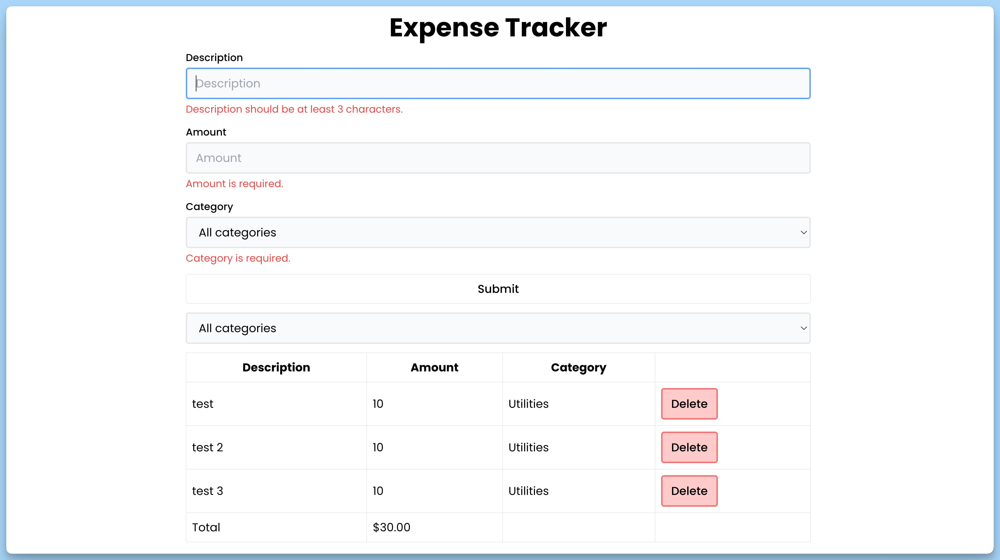

## 📦 Приложение - Трекер расходов

### 🚀 Обзор
Данный код представляет собой React-приложение для отслеживания расходов. Вот его основные элементы:

- **App**: Это главный компонент приложения. Он отображает список расходов, позволяет фильтровать их по категории и добавлять новые расходы.

- **Form**: Этот компонент представляет форму для ввода данных о новом расходе. Он включает валидацию с использованием Zod.

- **Filter**: Этот компонент отображает выпадающий список для фильтрации расходов по категории.

- **List**: Этот компонент отображает список расходов в виде таблицы. Он также рассчитывает общую сумму расходов.

Приложение начинается с инициализации нескольких расходов. Пользователь может добавлять новые расходы с помощью формы и фильтровать существующие расходы по категории.

JSDoc комментарии присутствуют для всех компонентов и интерфейсов, обеспечивая описание их работы и свойств.

---
#### 🌄 Превью:

-----
#### 🙌 Автор: [@nagoev-alim](https://github.com/nagoev-alim)

