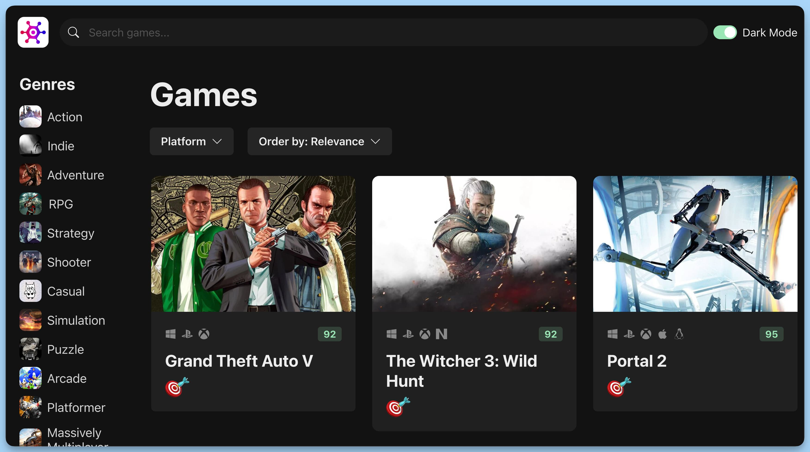

## 📦 Приложение - GameHub

### 🚀 Обзор
Код представляет главный компонент приложения "Game Search", написанного на React и использующего библиотеку Chakra UI для построения пользовательского интерфейса.

### Импорты

Исходный код начинается с импортов необходимых зависимостей, компонентов и интерфейсов.

### Интерфейс `GameQuery`

Создан интерфейс `GameQuery`, описывающий структуру запроса для поиска игр. Включает в себя следующие свойства:

- `genre` (Жанр игры, может быть `null`).
- `platform` (Платформа игры, может быть `null`).
- `sortOrder` (Порядок сортировки результатов поиска).
- `searchText` (Текст для поиска игр).

### Главный Компонент `App`

Основной компонент приложения "Game Search". Содержит следующие основные элементы:

- Состояние `gameQuery`, отображающее текущий запрос для поиска игр.
- Сетку `Grid`, определенную с помощью Chakra UI для организации макета страницы.

### Навигационная Панель `NavBar`

Компонент `NavBar` представляет навигационную панель приложения. Включает в себя логотип, поле поиска и переключатель темы.

### Список Жанров `GenreList`

Компонент `GenreList` позволяет выбрать жанр игр для фильтрации результатов поиска.

### Заголовок `GameHeading`

Компонент `GameHeading` отображает информацию о текущем запросе, включая выбранный жанр и платформу игр.

### Селектор Платформы `PlatformSelector`

`PlatformSelector` позволяет выбирать платформу для фильтрации результатов поиска.

### Селектор Сортировки `SortSelector`

`SortSelector` предоставляет опции для сортировки результатов поиска по различным параметрам.

### Сетка Игр `GameGrid`

`GameGrid` - это компонент, отображающий сетку игр с учетом текущего запроса.

### Экспорт `App`

Завершается код экспортом компонента `App`, который будет использоваться для отображения главной страницы приложения.

---
#### 🌄 Превью:

-----
#### 🙌 Автор: [@nagoev-alim](https://github.com/nagoev-alim)

