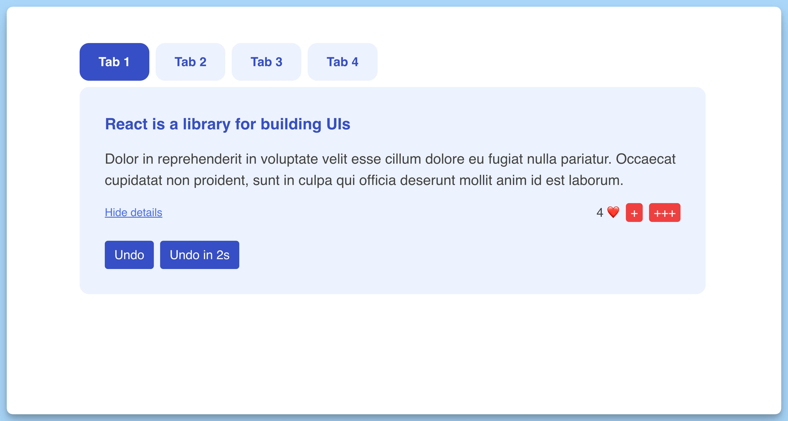

## 📦 Приложение - Табы

### 🚀 Обзор
Этот код представляет собой главный компонент приложения React. Вот краткое описание его функциональности:

- Импортируются необходимые зависимости React и пользовательских компонентов.
- Создается функциональный компонент `App`, который представляет главный контейнер приложения.
- В состоянии компонента хранится `activeTab`, представляющая активную вкладку.
- На экране отображаются вкладки, представленные компонентом `Tab`. Количество вкладок определяется массивом `[0, 1, 2, 3]`, и каждая вкладка получает свой номер, текущую активную вкладку (`activeTab`) и функцию обработки щелчка для изменения активной вкладки.
- В зависимости от `activeTab` отображается содержимое внутри вкладки. Если `activeTab` меньше или равно 2, то отображается `TabContent`, который получает данные из массива `content`. В противном случае отображается компонент `DifferentContent`.
- `key` используется для уникальной идентификации компонентов при отрисовке и обновлении.

Этот компонент создает интерфейс с вкладками, позволяет пользователю выбирать вкладку, и отображает разное содержимое в зависимости от выбранной вкладки.

---
#### 🌄 Превью:

-----
#### 🙌 Автор: [@nagoev-alim](https://github.com/nagoev-alim)

