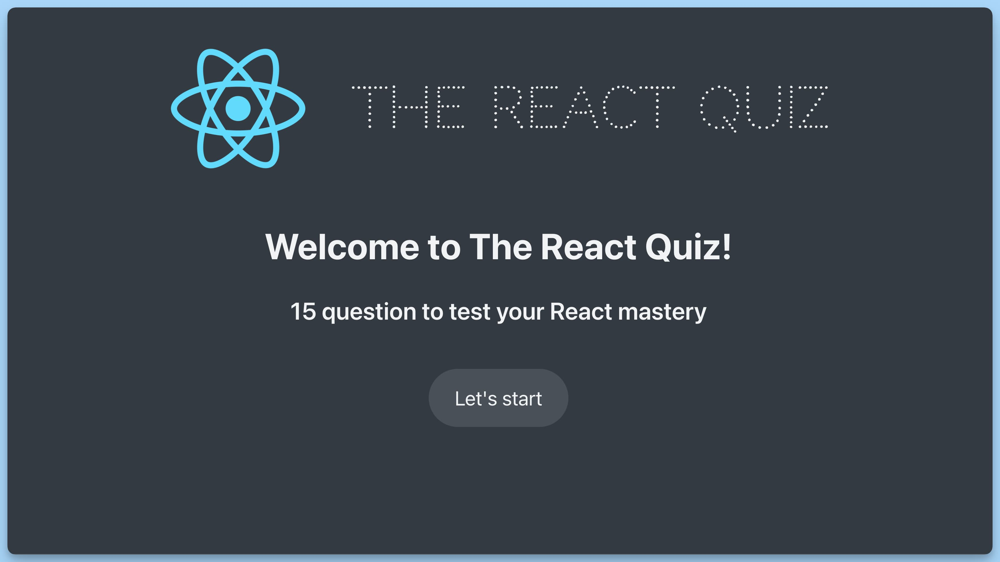
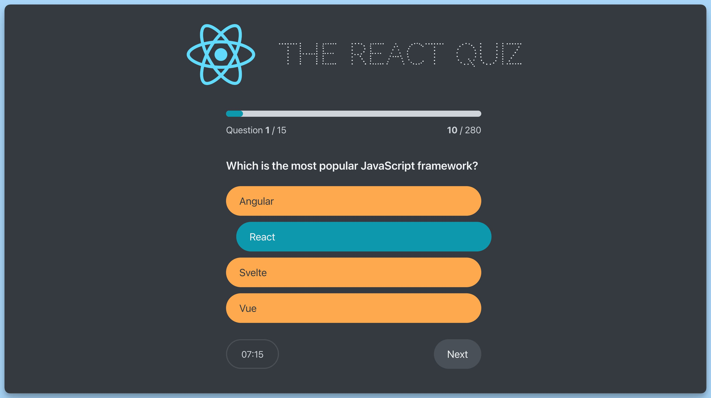

## 📦 Приложение - Квиз

### 🚀 Обзор
Этот код представляет собой главный компонент приложения React, предназначенного для викторины (Quiz). Вот краткое описание его функциональности:

- Импортируются необходимые зависимости, такие как React, библиотека axios для выполнения HTTP-запросов, константы `APP_STATES` и `TYPES` из файла `constants.ts`, и `useAppContext` из контекста `AppContext.tsx`.
- Импортируются компоненты, используемые внутри приложения, такие как `Header`, `Loader`, `Error`, `StartScreen`, `Question`, `Progress`, `Footer`, `Timer`, `NextButton`, `FinishScreen` и `Main`.
- Создается функциональный компонент `App`, который представляет главный контейнер приложения "Quiz".
- Используется контекст `useAppContext` для получения состояния и диспетчера приложения.
- Вычисляются общее количество вопросов (`numOfQuestions`) и общее количество баллов (`totalPoints`) на основе данных вопросов.
- Используется `useEffect` для выполнения асинхронного запроса к серверу (`http://localhost:8000/questions`) с вопросами. После получения данных, они передаются в состояние приложения через `dispatch`.
- В зависимости от статуса приложения (определенного в `status`), отображаются различные компоненты, такие как экраны загрузки, ошибки, начальный экран, экран вопросов, экран завершения викторины и т. д.
- Компонент `App` оборачивает в себя другие компоненты и формирует общий интерфейс приложения "Quiz".

Этот компонент управляет отображением различных состояний приложения, включая начальный экран, вопросы, прогресс, таймер, и экран завершения викторины, а также обработку данных и ошибок при загрузке вопросов.

---
#### 🌄 Превью:

-----
#### 🙌 Автор: [@nagoev-alim](https://github.com/nagoev-alim)

